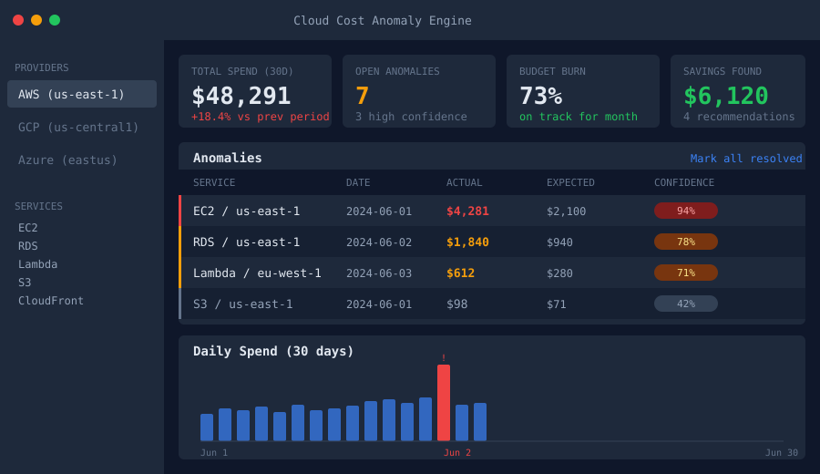

# cloud-cost-anomaly-engine

Real-time cloud cost anomaly detection across AWS, GCP, and Azure. Ingests daily billing exports, runs z-score analysis over a 30-day rolling window, and surfaces spend spikes in a dashboard before they turn into a nasty end-of-month surprise.



## Why I built this

Our AWS bill jumped 40% one month and nobody noticed until finance flagged it three weeks later. The culprit was a forgotten load test that left 12 r5.4xlarge instances running in a non-prod account. By then the damage was done.

The obvious fix would have been AWS Cost Anomaly Detection, but it only covers AWS and the alerting took 24-48 hours to trigger. We also had GCP spend that needed watching. I wanted something that could ingest from multiple providers, use a tighter statistical window, and alert the same day.

The main tradeoff I made was choosing z-score over a fancier time-series model (Prophet, etc.). Z-score is fast, explainable, and works with 14 days of history rather than 90+. The false-positive rate is higher, but engineers trust it because they can understand why it fired. If I were starting over, I would add day-of-week normalisation, since weekend spend is structurally lower and currently inflates the stddev on Mondays.

## What it does

- Pulls daily cost records from AWS Cost Explorer, GCP Billing Export, and Azure Cost Management
- Computes per-service z-scores over a configurable rolling window (default 30 days)
- Flags anomalies above a confidence threshold and stores them in Postgres
- Serves a React dashboard with spend breakdown charts, anomaly list, budget burn gauges, and one-click recommendations
- Exposes REST endpoints for external alerting integrations (PagerDuty, Slack webhook)

## Test output

```
$ pytest tests/ -v

tests/test_detector.py::TestZScore::test_normal_spend_not_flagged        PASSED
tests/test_detector.py::TestZScore::test_spike_flagged                   PASSED
tests/test_detector.py::TestZScore::test_below_min_history_skipped       PASSED
tests/test_detector.py::TestZScore::test_zero_stddev_does_not_raise      PASSED
tests/test_detector.py::TestZScore::test_confidence_between_zero_and_one PASSED
tests/test_detector.py::TestZScore::test_confidence_higher_for_larger_spike PASSED
tests/test_detector.py::TestDetectorRun::test_detect_inserts_anomaly     PASSED
tests/test_detector.py::TestDetectorRun::test_no_anomaly_on_stable_spend PASSED
tests/test_detector.py::TestPipelineTagSerialisation::test_tags_with_special_chars_survive_round_trip PASSED
tests/test_detector.py::TestPipelineTagSerialisation::test_bool_values_are_lowercase_json PASSED

10 passed in 0.41s
```

## Stack

- Backend: Python 3.12, FastAPI, SQLAlchemy (async), PostgreSQL
- Frontend: React 18, TypeScript, Vite, Recharts, Tailwind CSS
- Infra: Docker Compose

## Running locally

```bash
cp .env.example .env
# fill in AWS_ACCESS_KEY_ID, AWS_SECRET_ACCESS_KEY, and DATABASE_URL

docker compose up --build
```

Backend at `http://localhost:8000`, frontend at `http://localhost:5173`.

Manual ingestion trigger after startup:

```bash
curl -X POST http://localhost:8000/api/v1/ingest/trigger
```

### Running tests

```bash
cd backend
pip install -r requirements.txt pytest pytest-asyncio
pytest tests/ -v
```

## API

```
GET  /api/v1/costs           - paginated cost records
GET  /api/v1/anomalies       - open anomalies, filterable by provider
POST /api/v1/anomalies/{id}/resolve
POST /api/v1/anomalies/detect - manual detection trigger
GET  /api/v1/budgets
POST /api/v1/budgets
GET  /api/v1/recommendations
POST /api/v1/recommendations/refresh
POST /api/v1/ingest/trigger
```

## Anomaly tuning

| Parameter | Default | Notes |
|---|---|---|
| `Z_THRESHOLD` | 2.5 | Lower catches more, more false positives |
| `MIN_HISTORY_DAYS` | 14 | Services newer than this are skipped |
| `ROLLING_WINDOW` | 30 | Days of history for mean/stddev calculation |
